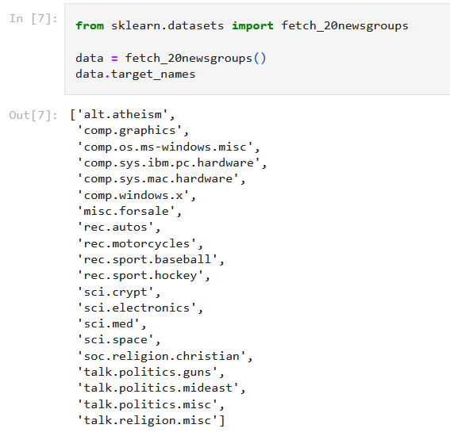
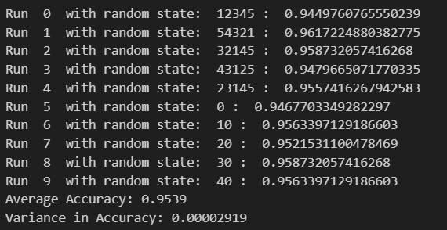
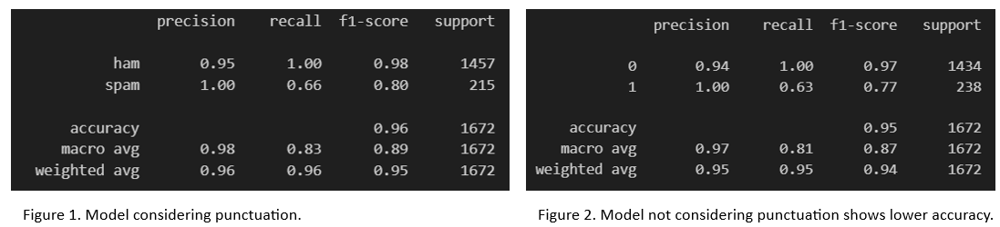
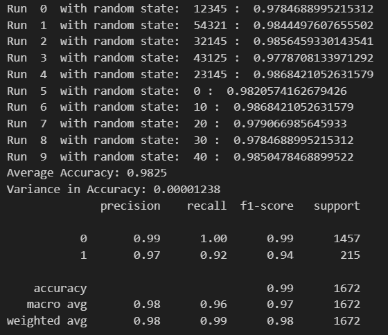

# ChangeLog

## Changes

### Collab Notebook
If you wish to experiment with the code, you can find the notebook on Google Collab at the following link:<br> https://colab.research.google.com/drive/1-z2FgsH9BkNQTK1XsxBYCmLFVL2eCqEp?usp=drive_link

### Project Goals
<p> This project was inspired by a notebook explaining the basis of Naive Bayes machine learning techniques. The goal of the notebook being followed is to classify newsgroup text into a number of categories representing the newsgroup from which the text was retrieved. A sample of these categories.</p>
<br>



<br>
If you wish to view that notebook if can be found at the following link: https://github.com/jakevdp/PythonDataScienceHandbook/blob/8a34a4f653bdbdc01415a94dc20d4e9b97438965/notebooks/05.05-Naive-Bayes.ipynb .
<br>


The goal of this adapted project has been changed to the binary classification of a string of text taken from a number of SMS messages into either Spam or not Spam classes. This project will attempt to use Naive Bayes machine learning techniques to make these classifications.

### Data Source
<p> The first change from the source notebook is that the notebook retrieves the data it uses for its predictions from included datasets within the sklearn platform. This project instead sources its data from kaggle using the SMS Spam Collection Dataset .
</p>

#### Dataset
**SMS Spam Collection Dataset**
    - **Description**: This dataset contains a 5,574 SMS messages sources from a number of free or free for research online resources. Each row contains a string representing the message and a label being either 'ham' for non-spam messages or 'spam' for messages deemed to be spam.
    - **Usage**: The dataset will be used to train a Naive Bayes classifier to classify message or either spam or not spam.
    - **Source Quality**: This dataset was sourced from Kaggle and features a high usability score from Kaggle users.
    - **Link**: [here](https://www.kaggle.com/datasets/uciml/sms-spam-collection-dataset)
    
### Data Preprocessing
<p> As the data source is changed, some changes to the preprocessing were also required for this project.</p>

#### Checking for null values
<p> Some checks are made to ensure that the data is clean and there are no null values in the dataset. This check showed that there are no rows with null values to be addressed. </p>

```
df[df.isnull().any(axis=1)].count()
```

#### Dropping unneeded columns
<p> The dataset included three commas at the end of each row which created 3 unneeded columns once parsed. These columns were dropped. </p>

```
df.drop(columns=['Unnamed: 2', 'Unnamed: 3', 'Unnamed: 4'], inplace=True)
```
### Model Creation

#### Feature Preparation
<p> This project prepares the data for modelling in a different way given the changed data source and the fact that this is a binary classfication algorithm with a single feature variable. The corrected variables are placed in X and y arrays and reshaped to flatten both arrays.</p>

#### Target Variable Encoding
<p> This project then uses a label encoder to encode categorical target variable. O for ham and 1 for spam </p>

```
from sklearn.preprocessing import LabelEncoder
labels = ['ham','spam']
lab_encoder = LabelEncoder()
y = lab_encoder.fit_transform(y)
```

### Model Evaluation

#### Classification Report
<p> Here this project does additional metrics to evaluate the model by preparing a classification report </p> 

#### Evaluation Function
<p> This project creates a custom evaluation function which is designed to test the variance of different models across different subsets of the data. This function takes as parameters, the X and y arrays, the number of iterations that should be run, the training/test split size, the text encoding function, the model types and a boolean that states whether random random_states should be used or not. </p>

```
def evaluate_variance(X, y, num_iterations, test_size, textEncoder, modelType, random_state=True):
    accuracy_scores = []

    if not random_state:
        num_iterations = 10
        
    for i in range(num_iterations):

        random_states = [12345, 54321, 32145, 43125, 23145, 0, 10, 20, 30, 40, 50]

        if random_state:
            random_states = np.random.randint(1, 100000, size=num_iterations)

        X_train, X_test, y_train, y_test = train_test_split(X, y, test_size=test_size, random_state=random_states[i])
        
        # Create and fit the model
        model = make_pipeline(textEncoder, modelType)
        model.fit(X_train, y_train)
        
        # Make predictions and calculate accuracy
        y_pred = model.predict(X_test)
        accuracy = accuracy_score(y_test, y_pred)
        print("Run ", i, " with random state: ", random_states[i], ": ",accuracy)
        accuracy_scores.append(accuracy)

    # Calculate the average accuracy and variance
    average_accuracy = np.mean(accuracy_scores)
    variance_accuracy = np.var(accuracy_scores)
        
    return average_accuracy, variance_accuracy
```
<p> The result of this analysis showed the model to have low variance across different splits of the training data indicating that it may generalise well to unseen data.</p>



#### Feature Engineering
<p> Another change from the original project was the performance of feature engineering on the input data in an attempt to try and increase model accuracy. The following changes were conducted and the difference in model performance was evaluated. </p>

##### Feature Changes
1. Ignore Case: All words in X are made lowercase. This change had no effect on the accuracy of algorithm indicating that case does not seem to be predictive in the classification of the spam messages.
2. Removing Punctuation: All punctuation is removed from X. This lowered accuracy from 0.9539 to 0.9451. This implies punctuation is useful in the detection of Spam messages. In particular removing punctuation led to more false positives for spam messages.



#### Model Selection
<p> This project also tried to experiment with different encodings and algorithm variations to try and get the highest accuracy possible for predictions.</p>

1. CountVectorizer for text encoding: The text encoding method was switched to a simple CountVectorizer from the TFid encoding method. With TFid the word has an associated weight based off it frequency of occurence against its frequency of occurence across all inputs. CountVectorizer however simply counts word frequencies like TFid but does not add a weight to word importance. This change boosted accuracy from .9539 to .9825 and greatly reduced false positive rates for Spam messages. This seems to suggest word frequency in a single message is more predictive than how rare the occurence of the word is across all documents. 



2. CountVectorizer ignoring frequency: Using the binary=True option on CountVectorizer makes all non-zero frequencies = 1. So this only uses a binary consideration of whether a word is within a message or not. With this option, accuracy dropped from .9825 to .9817. This result shows that word frequency, perhaps surprisely, while useful does not have that great an impact on model accuracy.
3. BernoulliDB: As BernoulliNB is designed for binary values, the next test was to switch to this model while keeping CountVectorizer with binary set to True. Even though Bernoulli is designed to work with binary values, it performs worse than Multinomial Naive Bayes with accuracy of .96

<p>Overall the best performance was achieved using a combination of CountVectorizer for text encoding and MultinomialNB. </p>

### Deployment
<p> Another change to this project is that a simple webapp was created to demonstrate the deployment of such a model. As such at the end of this Jupyter notebook, pickle was used to dump the finetuned model to a file with the following code.
    
```
```

This file was then used to build an online webapp using the model to predict if entered text is SPAM. You can find at the following website (http://roadlesswalked.pythonanywhere.com/), please feel free to try it out. </p>

